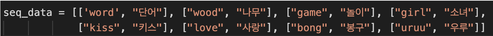
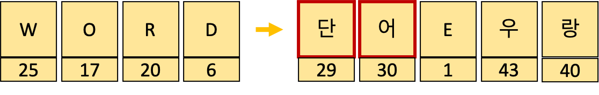
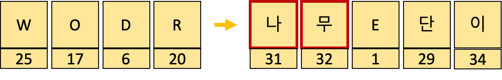
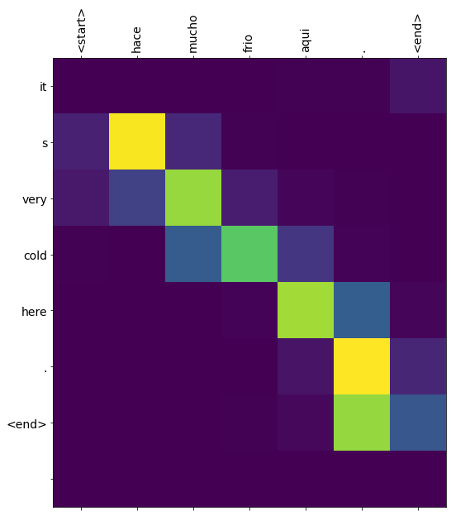

# 🎓 RNN Translation 🎓
RNN 을 활용한 기계번역  

Tensorflow  / Keras 을 이용한 RNN 공부 & 예제 실습


### 1. DeepLearningToAll (모두를 위한 딥러닝) - RNN

---

참고 : https://github.com/hunkim/DeepLearningZeroToAll

범위 : 시즌1 딥러닝의 기본 - Recurrent Neural Network 실습1 ~ 실습6


### 2. Tensorflow 을 이용한 영단어 번역 예제

---

참고 : https://woolulu.tistory.com/131

코드 : [Word_Translate.py](https://github.com/aaajeong/Tensorflow_RNN/blob/main/Word_Translate/Word_Translate%202.py) 

- Seq2Seq 을 활용

- 각 문자를 문자와 인덱스 번호로 딕셔녀리 형태를 만든 다음에, 예측 단계에서는 각 문자 별 확률 값에 따라 가장 큰 값을 가지는 문자를 출력해 최종 결과를 내고 있었습니다. (tf.argmax)

- 총 45 개의 character 중 가장 큰 값을 가진 인덱스에 해당하는 문자를 출력.

  

```python
num_dic: {'S': 0, 'E': 1, 'P': 2, 'a': 3, 'b': 4, 'c': 5, 'd': 6, 'e': 7, 'f': 8, 'g': 9, 'h': 10, 'i': 11, 'j': 12, 'k': 13, 'l': 14, 'm': 15, 'n': 16, 'o': 17, 'p': 18, 'q': 19, 'r': 20, 's': 21, 't': 22, 'u': 23, 'v': 24, 'w': 25, 'x': 26, 'y': 27, 'z': 28, '단': 29, '어': 30, '나': 31, '무': 32, '놀': 33, '이': 34, '소': 35, '녀': 36, '키': 37, '스': 38, '사': 39, '랑': 40, '봉': 41, '구': 42, '우': 43, '루': 44}

```

1. 'Word' 를 '단어' 라고 **잘** 예측한 경우.



```python
int_value_model:  [[[-2 -3 -2 -4 -1 -3  0 -2 -2 -1 -2 -2 -1 -2  0 -4 -4 -6  0 -2 -2 -2 -2 -2 -4 -4 -1 -2  0 10 -4  3  3 -1  0  0 -2 -1 -4 -1 -1  0 -1  0  0] 
 	              [-6 -2 -3 -3 -3 -3 -2 -4 -1 -2 -1 -2 -1 -1 -3  0 -2 -3  0 -2 -1 -2 -4  -3 -1 -4 -3 -1 -3 -4 14 -3  4  1  0 -3 -1 -4  3 -1  2 -4  2  3  0] 
 	              [ 0 13  1  0 -1 -1 -2  0 -1  0  1  0 -1 -1 -1  1  0  2  0 -1  0 -4  0  -1  0  1  0  0  0 -2  0  0 -4 -2 -1 -1  1  0  1 -3  0 -2 -1 -1 -2]
                                     [ 0 -5 -1  1  1  0  1  2 -2  0 -2 -1  0  0  0  0 -1  0  3  0  0 -1  0  1  0 -1  1  1  0  3  0  1  1  1  0  0  0 -2 -3  1 -1  1 -2  2  1]
                                     [-1  0 -2  0  0  0  0  1  0  0  1  0  0 -3 -1  0 -1  0  0  0  0  0  0  0 -2  0  0  1  0 -1  0  1  1 -2  6 -3  1  0 -4  0  2 -2 -1 -2  0]]]

```

```
29번째 인덱스 값 : 10(단)
30번째 인덱스 값 : 14(어)
```


2. 'Wodr' 을 '나무' 라고 **잘못** 예측한 경우



```python
int_value_model:  [[[ 0  0 -1 -2 -2 -2  0 -4  0  0 -1  0 -1 -1 -1 -3  0 -1  0 -2 -1 -1 -2  0  0 -1 -1 -1 -1  5  1  8  5  0  1 -2 -3  0 -6  1  1 -1  0 -3 -1] 
  [-2  0 -1  1 -2  0  0 -2 -4 -2 -1 -2  0 -1 -2 -2  0 -1 -1 -2  0  0 -3  -2 -1 -1 -2  0 -2  2  6 -2  8  1  1  0  0 -2  3 -6  1 -2  4 -1 -2] 
  [-3 15 -7 -3 -3 -1 -2 -2 -1 -2 -2 -4  2  0 -1  0 -1 -4 -2 -2  0 -1 -3 -3 -1 -3 -1 -1 -1 -4  4  0 -4 -3  2  0  5 -2 -2 -2  1 -1 -2  2  0]
  [ 1  0  0  0  1  1 -1  0 -1  0 -1  2  0  0 -1  2  0 -2 -1  0 -2 -2  0 -1  0  0  0 -2  0  6  1  2  1  3  3  6  0 -2  0 -1 -7 -2 -5  2 -1]
  [-1  0 -2 -1 -1 -1 -2 -3 -2  0 -3  0 -4 -2  0  0 -1 -3 -2 -3 -4 -2 -3  -1  0 -2  0  0 -2  5  5  0  0 -3  6 -2  7 -1 -3  0  1 -4 -2 -3  6]]]

```

```
31번째 인덱스 값 : 8 (나)
32번째 인덱스 값 : 8 (무)
----------------------
29번째 인덱스 값 : 5 (단)
30번째 인덱스 값 : 6 (어)
```

3. Uncertainty 와 관련지어 생각해보기

- **Wodr** 이 word(단어), wood(나무) 와 비슷해서, *단어*, *나무* 라고 나올거라고 예측했는데, 실제로 argmax 하기 전의 값을 출력해보니, (나무), (단어)에 해당하는 인덱스에 해당하는 값들의 차이가 별로 나지 않는다는 것을 확인했다.
- 내가 생각하는 RNN 결과에 대한 **Candidate**
  - 다른 인덱스 보다 상대적으로 높은 점수를 가지고 있는 → '나무', '단어'
- Candidate 들 중, **Majority/Minority** 를 선택하는 과정에 대해서는 더 살펴봐야 할 것 같다.

4. 결론

   RNN 의 번역 예제에서도 CNN 과 같이 Uncertainty 을 적용할 수 있다는 점을 확인할 수 있었다. 더 깊은 이해를 위해서, 더 복잡한 모델을 사용한 예제를 통해 Uncertainty 을 파악해보면 좋을 것 같다.


### 3. Tensorflow 의 어텐션을 이용한 기계번역 예제

---

참고 : https://www.tensorflow.org/tutorials/text/nmt_with_attention?hl=ko#%EB%8D%B0%EC%9D%B4%ED%84%B0%EC%85%8B_%EB%8B%A4%EC%9A%B4%EB%A1%9C%EB%93%9C%ED%95%98%EA%B3%A0_%EC%A4%80%EB%B9%84%ED%95%98%EA%B8%B0

코드 : [nmt_with_attention.py](https://github.com/aaajeong/Tensorflow_RNN/blob/main/Attention_Translation/nmt_with_attention.ipynb)

- Attention 사용
- 스페인-영어 문장 쌍 데이터 활용
- 각 언어의 (단어-인덱스번호) 를 딕셔너리 형태로 만듦
- argmax 이용해서 prediction

예제)

**Input: <start> hace mucho frio aqui . <end>**

**Predicted translation: it s very cold here . <end>**



```python
1. Input 단어 딕셔너리 (스페인)

inp_lang.word_index :  {'<start>': 1, '<end>': 2, '.': 3, 'tom': 4, '?': 5, '¿': 6, 'es': 7, 'no': 8, 'el': 9, 'a': 10, 'que': 11, 'me': 12, 'la': 13, 'de': 14, 'un': 15, 'esta': 16, 'se': 17, 'lo': 18, 'mi': 19, 'en': 20, 'una': 21, 'por': 22, 'te': 23, 'estoy': 24, 'ella': 25, 'yo': 26, '!': 27, 'eso': 28, 'le': 29, 'esto': 30, 'tu': 31, ',': 32, 'los': 33, 'aqui': 34, 'soy': 35, 'muy': 36, 'tengo': 37, 'puedo': 38, 'las': 39, 'gusta': 40, 'mary': 41, 'tiene': 42, 'son': 43, 'con': 44, 'como': 45, 'quien': 46, 'estaba': 47, 'su': 48, 'este': 49, 'favor': 50, 'estas': 51, 'eres': 52, 'quiero': 53, 'ellos': 54, 'fue': 55, 'bien': 56, 'casa': 57, 'ahora': 58, 'tomas': 59, 'donde': 60, 'mas': 61, 'estan': 62, 'nos': 63, 'he': 64, 'solo': 65, 'puede': 66, 'ha': 67, 'era': 68, 'todos': 69, 'al': 70, 'para': 71, 'ir': 72, 'tan': 73, 'todo': 74, 'estamos': 75, 'necesito': 76, 'ya': 77, 'nadie': 78, 'puedes': 79, 'trabajo': 80, 'voy': 81, 'usted': 82, 'tienes': 83, 'demasiado': 84, 'ese': 85, 'nada': 86, 'y': 87, 'hay': 88, 'mucho': 89, 'nunca': 90, 'hizo': 91, 'perro': 92, 'esa': 93, 'algo': 94, 'libro': 95, 'hoy': 96, 'poco': 97, 'dos': 98, 'parece': 99, 'todavia': 100, 'dinero': 101, 'tiempo': 102, 'nuevo': 103, 'sabe': 104, 'somos': 105, 'quiere': 106, 'mis': 107, 'gustan': 108, 'ser': 109, 'nosotros': 110, 'vez': 111, 'coche': 112, 'estar': 113, 'sos': 114, 'feliz': 115, 'va': 116, 'buen': 117, 'tarde': 118, 'ti': 119, 'ahi': 120, 'frances': 121, .... , 'caminamos': 9406, 'divertir': 9407, 'divertiremos': 9408, 'divertirnos': 9409, 'decepcionaremos': 9410, 'viviremos': 9411, 'reyes': 9412, 'perderemos': 9413}


```

```python
2. Target ouput 단어 딕셔너리 (영어)

targ_lang.word_index: {'<start>': 1, '<end>': 2, '.': 3, 'i': 4, 'tom': 5, 'you': 6, '?': 7, 'is': 8, 'a': 9, 'it': 10, 's': 11, 't': 12, 'the': 13, 'he': 14, 'to': 15, 'we': 16, 'me': 17, 'm': 18, 'this': 19, 'that': 20, 'my': 21, 'do': 22, 're': 23, 'are': 24, 'can': 25, 'was': 26, 'she': 27, 'they': 28, 'have': 29, 'don': 30, 'your': 31, 'what': 32, 'in': 33, 'not': 34, 'like': 35, 'go': 36, '!': 37, 'll': 38, 'here': 39, 'be': 40, 'him': 41, 'did': 42, 'know': 43, 'on': 44, 'mary': 45, 'let': 46, 'want': 47, 'very': 48, ',': 49, 'up': 50, 'has': 51, 'how': 52, 'come': 53, 'for': 54, 'at': 55, 'please': 56, 'there': 57, 'now': 58, 'of': 59, 'who': 60, 'his': 61, 'am': 62, 'need': 63, 'get': 64, 've': 65, 'no': 66, 'all': 67, 'her': 68, 'good': 69, 'just': 70, 'where': 71, 'see': 72, 'help': 73, 'out': 74, 'will': 75, 'got': 76, 'love': 77, 'too': 78, 'an': 79, 'with': 80, 'us': 81, 'why': 82, 'car': 83, 'one': 84, 'so': 85, 'stop': 86, 'didn': 87, 'look': 88, 'home': 89, 'isn': 90, 'back': 91, 'were': 92, 'work': 93, 'take': 94, 'saw': 95, 'may': 96, 'time': 97, 'give': 98, 'had': 99, 'won': 100, 'happy': 101, 'leave': 102, 'still': 103, 'dog': 104, 'lost': 105, 'never': 106, 'right': 107, 'must': 108, 'well': 109, 'today': 110, 'keep': 111, 'eat': 112, 'book': 113, 'think': 114, 'money': 115, 'tell': 116, 'made': 117, 'went': 118, 'about': 119, 'stay': 120, 'likes': 121, 'call': 122, 'should': 123, 'does': 124, 'try': 125, 'them': 126, 'speak': 127, 'down': 128, 'going': 129, 'really': 130, 'again': 131, 'wait': 132, 'hate': 133, 'job': 134, ... 'inconsiderate': 4924, 'frail': 4925, 'eyepatch': 4926, 'triathlon': 4927, 'drying': 4928, 'agonized': 4929, 'pochi': 4930, 'voyage': 4931, 'customers': 4932, 'rescue': 4933, 'kings': 4934}
```

* Predction 과정

  ```python
  dec_input :  tf.Tensor([[1]], shape=(1, 1), dtype=int32)
  predictions:  tf.Tensor([[-7.6920695 -7.9410057  3.7609155 ... -7.966941  -8.275783  -3.6639626]], shape=(1, 4935), dtype=float32)
  predictions[0] :  tf.Tensor([-7.6920695 -7.9410057  3.7609155 ... -7.966941  -8.275783  -3.6639626], shape=(4935,), dtype=float32)
  predicted_id :  10
  predicted_id: 10
  
  dec_input :  tf.Tensor([[10]], shape=(1, 1), dtype=int32)
  predictions:  tf.Tensor(
  [[-3.7087708  -3.785742    0.87895715 ... -3.542118   -3.9272754
    -6.3847866 ]], shape=(1, 4935), dtype=float32)
  predictions[0] :  tf.Tensor(
  [-3.7087708  -3.785742    0.87895715 ... -3.542118   -3.9272754
   -6.3847866 ], shape=(4935,), dtype=float32)
  predicted_id :  11
  predicted_id: 11
  
  dec_input :  tf.Tensor([[11]], shape=(1, 1), dtype=int32)
  predictions:  tf.Tensor([[-6.1398396 -6.8509164 -4.2431827 ... -3.347466  -7.0388927 -4.201827 ]], shape=(1, 4935), dtype=float32)
  predictions[0] :  tf.Tensor([-6.1398396 -6.8509164 -4.2431827 ... -3.347466  -7.0388927 -4.201827 ], shape=(4935,), dtype=float32)
  predicted_id :  48
  predicted_id: 48
  
  dec_input :  tf.Tensor([[48]], shape=(1, 1), dtype=int32)
  predictions:  tf.Tensor([[-4.268097  -3.901914  -6.04353   ...  1.5805762 -3.8647072  0.3761332]], shape=(1, 4935), dtype=float32)
  predictions[0] :  tf.Tensor([-4.268097  -3.901914  -6.04353   ...  1.5805762 -3.8647072  0.3761332], shape=(4935,), dtype=float32)
  predicted_id :  183
  predicted_id: 183
  
  dec_input :  tf.Tensor([[183]], shape=(1, 1), dtype=int32)
  predictions:  tf.Tensor([[-7.6481113 -7.8906865  6.026375  ... -6.455931  -8.064545  -2.5425792]], shape=(1, 4935), dtype=float32)
  predictions[0] :  tf.Tensor([-7.6481113 -7.8906865  6.026375  ... -6.455931  -8.064545  -2.5425792], shape=(4935,), dtype=float32)
  predicted_id :  39
  predicted_id: 39
  
  dec_input :  tf.Tensor([[39]], shape=(1, 1), dtype=int32)
  predictions:  tf.Tensor([[-11.042356 -11.3215     8.129159 ... -10.180486 -11.526742  -4.562274]], shape=(1, 4935), dtype=float32)
  predictions[0] :  tf.Tensor([-11.042356 -11.3215     8.129159 ... -10.180486 -11.526742  -4.562274], shape=(4935,), dtype=float32)
  predicted_id :  3
  predicted_id: 3
  
  dec_input :  tf.Tensor([[3]], shape=(1, 1), dtype=int32)
  predictions:  tf.Tensor(
  [[ -5.058864   -4.9537306  22.817942  ... -13.965756   -5.8914504
     -1.6094829]], shape=(1, 4935), dtype=float32)
  predictions[0] :  tf.Tensor(
  [ -5.058864   -4.9537306  22.817942  ... -13.965756   -5.8914504
    -1.6094829], shape=(4935,), dtype=float32)
  predicted_id :  2
  predicted_id: 2
  
  ```

* 어텐션 가중치 시각화

  

- Uncertainty & 결론 

  추후.


### 4. Keras Seq2Seq 활용 번역 예제

---

참고 : https://tykimos.github.io/2018/09/14/ten-minute_introduction_to_sequence-to-sequence_learning_in_Keras/

👉 코드 실행은 했지만 이해가 좀 더 필요함

